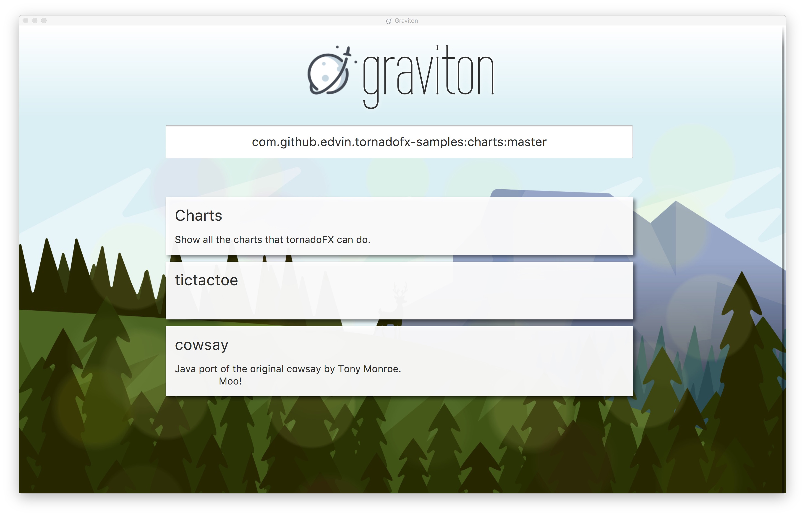

Newsletters
***********

10th December 2018
==================

Rampdown continues in preparation for the first release. Mac and Windows builds have passed the test plans, and testing
has now moved on to Linux (which has already revealed a strange visual bug). Many bugs have been fixed during this test phase.
Unfortunately, download cancellation had to be disabled, as it needs more work.

A new mailing list has been created in preparation for launch. Please join the `graviton-dev mailing list <https://groups.google.com/forum/#!forum/graviton-dev>`_.

I presented Graviton at JavaFX Days Zürich, which was a great conference. Feedback was overwhelmingly positive, and
some firms expressed interest in using it as a replacement for Java Web Start. Collaboration with Karakun on their
planned reimplementation of Web Start is a possibility in future. I have re-recorded the talk I gave; it can be viewed
here:

.. raw:: html

   

   <iframe width="700" height="393" src="https://www.youtube.com/embed/cyBN_ILkAtg" frameborder="0" allow="accelerometer; autoplay; encrypted-media; gyroscope; picture-in-picture" allowfullscreen></iframe>
   
 

27th November 2018
==================

I took my last few days of leave for the year to push Graviton Alpha over the finishing line. Significant work has been
done and the first release is nearly here! I will be presenting Graviton at JavaFX Days in Zürich next week.

* The big new feature this week is :doc:`graviton-apps`, which allows an app to establish communication with the browser
  despite running in an isolated classloader. It has `JavaDocs <_static/api/index.html>`_ and is extensible to support
  many future features. Currently it allows apps to opt back in to running in the main browser window. You can also
  opt-in to reusing the Graviton JVM and browser window using a manifest entry, for easier setup.
* The Proxy Vole library has been integrated. It enables automatic usage of proxy settings from the user's operating
  system settings (cross platform), browser settings (Firefox/IE), and can execute the JavaScript in proxy auto-config
  files. This should work for both GUI and command line apps.
* The UI has received some more visual polish.
* You can now use GitHub URLs as coordinates. It will use JitPack as normal.
* New installs get a few 'showcase' apps in their recent app pickers, so users have somewhere to start.
* JARs without a Main-Class manifest entry will now be scanned to locate a main method.
* A new :doc:`roadmap` page has been added with dozens of feature ideas for where Graviton can go in future.
* Signing keys have been obtained for Windows and macOS.
* Upgraded to Kotlin 1.3 and TinyLog 2

4th November 2018
=================

Many exciting things have happened since the last update. Most importantly a new contributor has arrived! Welcome to
Bernhard Luztmann who has contributed several improvements.

* Startup of the invoked program has been totally reworked. By default the program gets its own JVM process now,
  which increases app compatibility. However in some cases JavaFX apps are still invoked inline.
* The ``Cmd-Q`` key, which normally quits an app, now goes back to the shell window for inlined apps.
* Reverse DNS cooordinates work now, again thanks to Bernhard. Try ``plan99.net:tictactoe``
* Together we've added scrolling to the history list, which was one of the last items blocking release.
* The look has been refreshed to be cleaner.
* You can now right click on individual app history tiles to force a refresh.
* A new tutorial has been started, showing you how to start with the tiniest GUI app possible and incrementally adapt it for Graviton.

29th September 2018
===================

This week Windows command line tool support was finished. Java apps can now be invoked from the CLI or GUI, with
all the necessary workarounds for Windows' various console handling issues. ANSI escape support is activated via
the Win32 API for users on Windows 10.

23rd September 2018
===================

Not much to report this week:

* Windows runtime updates work now, and the Windows installer has been improved. This brings us closer to first release.
* Some initial work done on upgrading to Kotlin 1.3, but it's not quite ready to go yet.
* The code was simplified to not use coroutines any longer. It wasn't buying me much.
* New art: evening forest.
* Some rudimentary support for cancelling in-flight downloads.

17th September 2018
===================

Graviton had its first day out last week! I got up on stage and demoed a customised version to the audience at CordaCon,
a conference dedicated to the Corda decentralised, peer to peer database system (otherwise known as a a distributed ledger
or blockchain).

Corda is fully based on Java/Kotlin, and is thus a great fit for Graviton. Reception was warm, with one of the questions
at the end of the talk being "can we have Graviton yesterday?". Equally interesting to me was how many people were
struck by my demo of Scene Builder: quite a few came up and asked me what that GUI designer was and where they could get it.

To celebrate being introduced to the world, Graviton got a facelift:

.. raw:: html

   <video autoplay controls style="width: 100%"><source src="https://plan99.net/~mike/graviton/graviton-with-corda-720p.mov" type="video/mp4"></video>

Changes since last time:

* App history is now used to create a basic history list. Still lots of work to do here.
* Some basic support for customising the brand logo and name.
* Better support for jitpack.io
* Refactorings and bug fixes to keep the code clean.
* Added a (currently disabled) login screen, it's a work in progress and I might delete it.
* Possible to use videos now for the backdrop as well as pictures.

3rd September 2018
==================

The summer may be drawing to a close, but it's not all bad: Graviton development has returned! Changes this week:

* History infrastructure upgraded to store name and description from the POM files, ready for rendering.
* Support for building and running on both Java 8 and 10 at once.
* Progress bar tracking for downloads, better command line progress bar.
* Select the highest version of a module in a dependency graph instead of Maven's "nearest wins" heuristic, which was breaking
  some complex apps.
* Misc refactorings and improvements.

29th May 2018
=============

Progress report
^^^^^^^^^^^^^^^

* Apps are updated in the background every 6 hours if the user started them without a version specifier in the coordinate.
* Backported to Java 8. Too many things still break with Java 10, but there'll be another attempt in future with some extra logic added
  to increase app compatibility.
* Conscrypt is now used by default, it eliminates the overhead of using SSL entirely.
* Silent runtime updates are now fully working and tested on macOS. Free disk space is checked and updates are applied atomically, with
  signature checking to detect maliciously crafted updates.
* A logo has been selected. It may change in future but it'll do for now.
* A new download animation has been created.
* On macOS the app menu now has an about box and a clear cache option.

20th May 2018
=============

Progress report
^^^^^^^^^^^^^^^

After a short break spent on other tasks and video games, Graviton development returns! This week work focused on the Chrome-style
runtime auto update mechanism. Many of the pieces of this critical component have been laid previously, and now the final piece is landing:
download and activation.

* A new domain name has been acquired: `graviton.app <https://graviton.app/>`_. For now it just redirects to the docsite.
* A simple update protocol has been defined and implemented. It is described in :doc:`browser-update`. It still needs to be adapted for
  Windows, but the bulk of the code is platform independent.
* New background art has been added to the shell, a vector art of Paris.
* Some more future feature ideas have been filed in github.

More work remains on the update framework: free disk space testing, Windows support, making updates fully atomic, checking for download
corruption and so on. These small things will come in the next batch of work.

16th April 2018
===============

Progress report
^^^^^^^^^^^^^^^

This week continued to fill out the current features:

* JavaFX apps are now invoked directly via instantiating their ``Application`` class, which lets them take over the
  main stage. Try ``net.plan99:tictactoe`` for an example.
* A logging framework has been integrated. Logs rotate when they get too large, they print nicely coloured output to
  terminals that support it and there are various helpers in the code. Try the ``--verbose`` flag to see it in action.
* The start of a history manager has been added.
* The app now caches resolved coordinates and classpaths for 24 hours. This means Maven Resolver isn't invoked at all
  when you use an app regularly, if you start an app without specifying a version number.
* Windows:

  * Background tasks work properly now.
  * JNA has been integrated. It's used to display a message box if an exception is thrown during startup, because Windows
    won't let you print to the console if you're a GUI app. But JNA will come in useful later for other things too.
  * Some investigation of how to handle the GUI/console app dichotomy that Windows has. Tasks were filed.

* Refactored the code to use co-routines, this enabled more sharing of code between the CLI and GUI frontends and cleaned
  up the logic quite significantly. A new ``AppLauncher`` class centralises handling of all app launch tasks.

Next steps
^^^^^^^^^^

The next big performance win will be to use the background task support to refresh apps in the history list in the
background, even when Graviton isn't in use. Most of the infrastructure is there now, it just has to be wired up. Once
that's done app startup will be near-instant after first use.

After that it's back to investigating why SSL halves performance.

8th April 2018
==============

Progress report
^^^^^^^^^^^^^^^

This was a productive first week!

* An especially big welcome to Anindya Chatterjee who has contributed improved Linux support:

  * Native bootstrap
  * Scheduling using cron
  * And packaging, which we improved to create DEBs. There is still some work to on the Linux package before it's ready however.

* We enabled parallel POM resolution, which doubled the speed of downloading applications.
* Performance investigation showed that SSL is a major performance hit at the moment, disabling it gives another 2x speed increase.
* The background task scheduler is now activated on first run for all three platforms, and removed on uninstallation for Windows.
* The design site was refreshed with a video of the shell, and an update for the altered product vision (see below).

The product vision received some tweaks this week - whereas previously it was imagined that apps would be written
specifically for Graviton, we have now introduced the concept of "incremental adaptation" in which existing apps that
exist in Maven repositories and on GitHub can be used out of the box, with no Graviton specific changes. Adding code to
interact with the platform will improve the user experience but is not a technical requirement. This is the result of
seeing that it's feasible to run apps direct from Maven repositories interactively.

Next steps
^^^^^^^^^^

Try to discover why SSL slows things down so much. Experimenting with an OkHttp backend to Maven Resolver might be a
good next step here, as Java SSL is known to be slow and OkHttp supports the Conscrypt security provider that uses
BoringSSL under the covers.

Improve the Linux package to install files into the numbered directory (or make it irrelevant for the Linux bootstrap program).

Implement a module that downloads and signature checks new platform-specific native images.